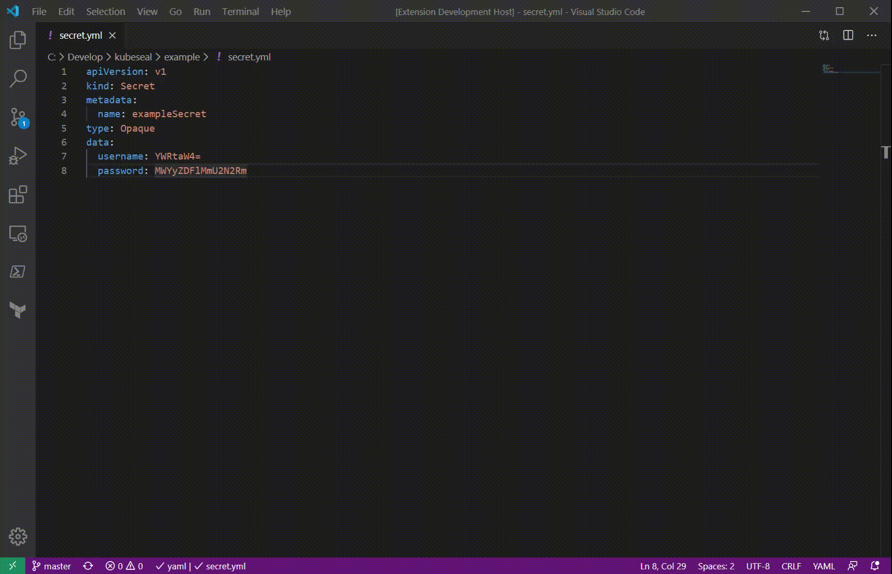
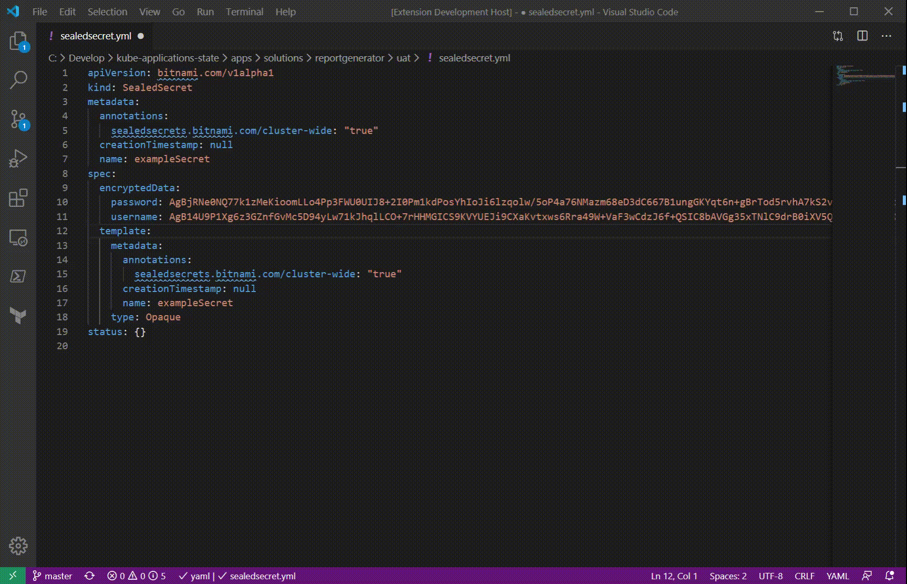

# Kubeseal extension for VS Code

This extension provides functionality for sealed kubernets secrets.
It wraps the command line utility `kubeseal` which is a part of the 
https://github.com/bitnami-labs/sealed-secrets.

## Features

You can use this extension to create a new sealed secrets file from an existing secret file.

A secret file may look like

```yaml
apiVersion: v1
kind: Secret
metadata:
  name: exampleSecret
type: Opaque
data:
  username: YWRtaW4=
  password: MWYyZDFlMmU2N2Rm
```

And the result may look like

```yaml
apiVersion: bitnami.com/v1alpha1
kind: SealedSecret
metadata:
  annotations:
    sealedsecrets.bitnami.com/cluster-wide: "true"
  creationTimestamp: null
  name: exampleSecret
spec:
  encryptedData:
    password: AgBjRNe0NQ77k1zMeKioomLLo4Pp3FWU0UIJ8+2I0Pm1kdPosYhIoJi6lzqolw/5oP4a76NMazm68eD3dC667B1ungGKYqt6n+gBrTod5rvhA7kS2vLTXdv42siEcstUOCRSevQ5ad9CcsVjgvI8V+R2I7LwI9M5ps/wfWh5pHxfbZcP61iSmCEA5uZtYk576NlNG5RHoK7LdRGXB4535kn2CDoAP37seVQkjQnJJ1OnnVLO6YrZP0/7lMMDpiIDs4baQ8+MzeEyi+sN5+K7/OUO5Re3+QTeVrw4P1g3Ie1ZY9j27FjfDNH71mafCbvK8z5RwNSCCQRAM8KtJYknm+FdSQ7WQPs6OVIUAoSdzhaZw3gCEuVmjzVz4JYzSFuqmbMw4WbJaT2TMazsQFzDmaneizwpcA2HY9bMor2pY9ArLDw6ioIVG1ts+vrEnplb6D4i/n8xGk4fwkYebdD+JlG4DmjfTVMXaJsgemoI5Oveph9wmu5u8eAYQyGpXxhRZYnhgpMcti70d+y9M+SsTf95ffJ2j0HtGFPKlSMI2XKMIcSUEyGtFKczilbemRFd+0ARpnPmSTDc3VpBvY1zF+0Y88eruh8R0QOODjRR6ZtEAfVyhGtsfQCH3HVvoa/kPMwOORkn5EHQr+oZ/MIqPiYB061JLWcNe+9rr9S910g0eqKXeCnmFkTrS63y+Ru3V6BsW3f9oLMNWJZdu70=
    username: AgB14U9P1Xg6z3GZnfGvMc5D94yLw71kJhqlLCO+7rHHMGICS9KVYUEJi9CXaKvtxws6Rra49W+VaF3wCdzJ6f+QSIC8bAVGg35xTNlC9drB0iXV5Q4Svh9vnKJ+OGmIeAKx3xcWBiUDM6rLAZwjCU4bhChrLRHHmqAbZqlgdU5eoFjSDz5nfH7QARMej8HUKZT6hhrC0Sj9BpDFwGt9bi87MerZOVeIov/q4Bc+9iSGZtcGC4sfmVAQjT7HkyxotR+cp2JSzZuKKQ25h73L1ZqwiCyG7Fm2mZWTaQF2PzCrAUMt8jxSLtGiBH3tbgkSueB+ZAfzC9zjyJ1fUhzzJ/21J+GfGx6ezd5VTshk8YnKo+t8pTuShRp7QuHvMHF8lfGab8SirdbsGxuY0/OsmW27DYJ5xgPRLms1sjvTZG/+sVH4YONlTdR2yUSkPWcZb23kEPLf1IkcfJ8Zoe9QHFCqOl8OwM7FFqhbQ6i++BKlRg13BJfbM4Tl9nOJu3r9ELTv6nIBizihrp+7NKwefOoYMDlzyu8iPAK3nN6ZlmzlqhA30eZKWf5EVvRpS8Q+CBGykhY1YnfcdMiBM0MCdlAqOHEuBZV6pXCftiRG+1K5Jk906sq5+Nut/uJmY6Qc7LLExAEu+q83GYcQQud8GqLF0/l71YPuao+SOVQndQLR1v+G6Xlrx0E8GJ7zPDGFnfNuRyYq/g==
  template:
    metadata:
      annotations:
        sealedsecrets.bitnami.com/cluster-wide: "true"
      creationTimestamp: null
      name: exampleSecret
    type: Opaque
status: {}
```

The corresponding command line would look something like


```bash
kubeseal <mysecret.yml --scope cluster-wide --cert mycert.pem --format yaml >mysealedsecret.yml
```



You can also encrypt the currently selected text, corresponding to a a command line such as

```bash
echo -n selectedSecretText | kubeseal --raw --from-file=/dev/stdin --scope cluster-wide --cert mycert.pem
```



## Requirements

The plugin ships with a prebuilt version of kubeseal for windows. On other platforms, kubeseal must be installed as a prerequisite. Installation instructions can be found [here](https://github.com/bitnami-labs/sealed-secrets#installation).

## Extension Settings

* `kubeseal.executablePath`: path to kubeseal executable
* `kubeseal.useLocalCertificate`: Use local certificate file to seal secrets. Set to false if certificate is on your cluster.

## Known Issues

This extension is very much work in progress. 

## Release Notes

### 0.0.1

Initial release

### 0.0.2

Added tests. Improved default parameters. Miscellaneous fixes.

### 0.0.3

Improved select certificate dialog

### 0.0.4

Improved error handling and error messages when underlying command execution fails

### 0.0.5

Security patches (updated npm dependencies)

### 0.0.6

Making certificatePath optional to allow use of cluster-side certificates

### 0.0.7

Security patches, updated mocha test framework, typescript version and the plugin framework

### 0.0.8

Support for multi-cursor selection

